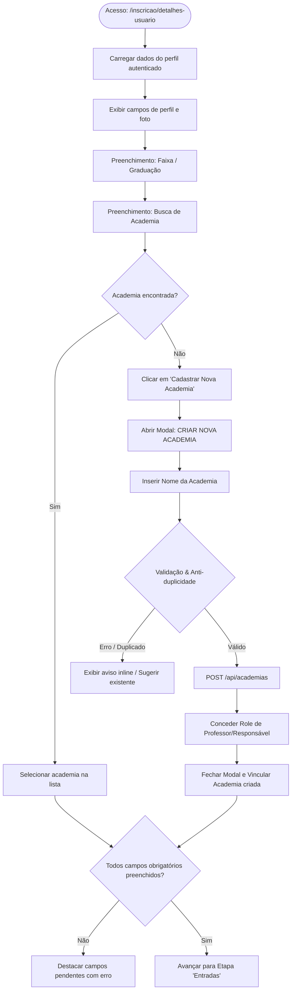

# Especificação de Fluxo de Usuário: Cadastro de Atleta (Tela de Detalhes)

**Módulo:** Cadastro & Inscrição de Atletas  
**Etapa:** `DETALHES DO USUÁRIO` (Funil: Detalhes do Usuário > Entradas > Pagamento)  
**Versão:** 1.0  
**Perfil:** Engenharia de Produto, Desenvolvimento e Garantia da Qualidade (QA)  

---

## 1. Visão Geral e Arquitetura do Fluxo

O objetivo deste fluxo é guiar o usuário na conferência de suas informações cadastrais e na inserção dos dados esportivos mandatórios (**Faixa/Graduação** e **Academia/Equipe**), garantindo integridade de chaveamento para competições.

O fluxo prevê uma rota de contingência assistida quando a agremiação do atleta não constar na base cadastral, permitindo a **criação dinâmica da academia**, a atribuição de permissão de **Professor/Responsável** ao criador e a vinculação automática dos dados sem perda de estado do formulário principal.



---

## 2. Dicionário de Dados e Regras de Negócio

### 2.1. Atributos da Tela de Detalhes

| Campo | Tipo / Formato | Obrigatoriedade | Modificabilidade | Descrição & Regra |
| :--- | :--- | :--- | :--- | :--- |
| **Primeiro Nome** | `String(50)` | Sim | Bloqueado (Read-only) | Recuperado do cadastro SSO. Não editável nesta etapa para evitar fraude de identidade. |
| **Sobrenomes** | `String(100)` | Sim | Bloqueado (Read-only) | Recuperado do cadastro SSO. |
| **Email** | `Email` | Sim | Bloqueado (Read-only) | E-mail de confirmação e chave de login do atleta. |
| **Nacionalidade** | `String` / ISO Code | Sim | Editável (inline) | Padrão `Brasil`. Validação contra catálogo de países. |
| **Data de Nascimento** | `Date (DD/MM/YYYY)` | Sim | Editável (inline) | Determina a categoria de idade do evento (ex: Juvenil, Adulto, Master). |
| **Gênero** | `Enum ('Masculino', 'Feminino')` | Sim | Editável (inline) | Determina as chaves de lutas do evento. |
| **Foto de Perfil** | `Binary / URL` (JPG, PNG) | Sim | Upload / Atualização | Resolução mínima 400x400px; máx. 5MB. Utilizada para crachá e checagem de pesagem. |
| **Faixa** | `Enum` (Branca, Azul, Roxa, Marrom, Preta, etc.) | Sim | Editável (Select) | Define a divisão técnica do atleta no campeonato. |
| **Academia** | `UUID` (Foreign Key) | Sim | Editável (Autocomplete) | Vínculo obrigatório da agremiação para cálculo do Ranking Geral por Equipes. |

---

## 3. Detalhamento Passo a Passo do Fluxo de Usuário

### Etapa 1: Acesso à Tela de Detalhes
1. O usuário acessa a rota do evento `/inscricao/detalhes-usuario`.
2. O sistema recupera a sessão ativa e pré-carrega os dados do atleta.
3. Os campos **Primeiro nome**, **Sobrenomes** e **Email** são apresentados com ícone de cadeado (bloqueados).
4. Os campos **Nacionalidade**, **Data de nascimento** e **Gênero** exibem botão `Editar`.
5. O container de **Imagem de Perfil** renderiza a foto atual do atleta ou o estado vazio com o texto *"CLIQUE ABAIXO PARA ENVIAR"*.

### Etapa 2: Preenchimento da Graduação (Faixa)
1. O usuário clica no seletor de "Faixa".
2. O sistema lista as opções compatíveis com a idade do competidor (ex: categorias infantis exibem faixas cinza, amarela, laranja, verde; categorias adultas exibem branca até preta).
3. O usuário seleciona sua graduação.

### Etapa 3: Busca e Seleção de Academia (Dropdown Inteligente)
1. O usuário foca no campo `Buscar ou selecionar academia...`.
2. Ao digitar ao menos 2 caracteres (com *debounce* de 300ms), a lista dinâmica filtra agremiações cadastradas na base.
3. **Cenário A (Academia Encontrada):**
   - O usuário localiza sua equipe (ex: *"Templum fight"*).
   - Clica sobre a opção.
   - O campo é preenchido com o nome e o `id` da academia é armazenado no estado local.
4. **Cenário B (Academia Não Encontrada):**
   - A lista de sugestões exibe o rodapé: *"Não encontrou a sua academia?"*.
   - É exibido o botão estilizado **`[+] Cadastrar Nova Academia`**.

---

## 4. Subfluxo Crítico: Criação de Nova Academia & Concessão de Acesso

### 4.1. Abertura do Modal de Criação
1. O usuário clica em **`Cadastrar Nova Academia`**.
2. A tela exibe um modal centralizado com efeito de fundo escurecido (*backdrop overlay*):
   - **Ícone visual:** Ilustração/ícone predial de agremiação.
   - **Título:** `CRIAR NOVA ACADEMIA`.
   - **Mensagem de responsabilidade:** *"Recomendamos que você peça ao gerente/professor da sua academia para realizar o cadastro."*
   - **Input:** `Nome da academia` (obrigatório, mínimo 3 caracteres).
   - **Ações:** Botão `Continuar` (desabilitado enquanto o campo estiver vazio) e botão `X` (fechar).

### 4.2. Validações e Regras Anti-Duplicidade
1. O usuário insere o nome da academia e clica em `Continuar`.
2. O sistema envia requisição para validação de unicidade:
   - Se houver agremiação existente com nome idêntico ou similaridade fonética superior a 85%, exibe alerta: *"Encontramos uma academia com nome semelhante: '[Nome]'. Deseja vinculá-la?"*.
   - Se for um registro inédito, a nova academia é persistida na base com status ativo (ou pré-aprovado).

### 4.3. Concessão de Permissão (Role: Professor / Responsável)
1. Como o usuário está criando uma agremiação inédita no sistema, a regra de negócio concede automaticamente a este usuário o papel de **Responsável Técnico / Professor** da academia recém-criada.
2. Registra-se na tabela de permissões: `role = PROFESSOR_ACADEMIA` associado ao `academia_id`.
3. Uma notificação interna/e-mail é disparada orientando sobre a posterior inclusão de dados fiscais (CNPJ, endereço, etc.).

### 4.4. Retorno Transparente e Preenchimento Automático
1. O modal se fecha automaticamente.
2. Uma mensagem temporária (Toast) de sucesso é exibida: *"Academia cadastrada com sucesso!"*.
3. O campo **Academia** na tela de detalhes recebe imediatamente o nome e o identificador da agremiação recém-criada.
4. **Resiliência de Estado:** Todos os dados previamente preenchidos (faixa, gênero, nacionalidade, foto) permanecem intactos, sem recarregamento da página.

---

## 5. Cenários de Erro e Tratamento de Exceções

| Cenário de Erro | Comportamento do Sistema | Mensagem ao Usuário |
| :--- | :--- | :--- |
| **Tentativa de avançar sem Faixa** | Impede o avanço; scroll suave até o campo; borda vermelha. | *"Selecione sua faixa para continuar."* |
| **Tentativa de avançar sem Academia** | Impede o avanço; borda vermelha no input de busca. | *"Selecione ou cadastre uma academia vinculada."* |
| **Nome da academia com menos de 3 caracteres** | Desabilita botão 'Continuar' no modal; exibe aviso inline. | *"O nome da academia deve ter pelo menos 3 caracteres."* |
| **Falha de conexão / API Offline** | Exibe alerta de erro temporário com opção de 'Tentar novamente'. | *"Não foi possível criar a academia. Verifique sua conexão e tente novamente."* |
| **Usuário cancela criação (Clica em X ou fora do modal)** | Fecha o modal sem salvar; mantém o texto digitado na busca. | Nenhuma (retorno ao estado anterior). |

---

## 6. Pontos Críticos e Requisitos Não-Funcionais

1. **Segurança (Zero Trust no Backend):**
   - Dados sensíveis bloqueados na UI (`Nome`, `Sobrenomes`, `E-mail`) devem ser validados no backend via token JWT da sessão, ignorando qualquer tentativa de manipulação via payload HTTP.
2. **Prevenção de Spam (Rate Limiting):**
   - Limitar a criação de até 2 academias por usuário a cada 24 horas para mitigar agremiações falsas ou duplicadas.
3. **Persistência de Rascunho (*Draft State*):**
   - Em caso de refresh involuntário da tela, os dados transitórios devem ser preservados via `sessionStorage` ou gerenciador de estado global.
4. **Acessibilidade & Usabilidade:**
   - O modal deve suportar fechamento via tecla `ESC` e navegação completa por teclado (`Tab`, `Shift+Tab`, `Enter`).

---

## 7. Critérios de Aceite para Testes (QA / Gherkin)

```gherkin
Cenário: Seleção com sucesso de academia existente
  Dado que o atleta está na etapa "DETALHES DO USUÁRIO"
  Quando ele seleciona sua "Faixa"
  E digita o nome de sua academia no campo de busca
  E clica na opção correspondente na lista
  E clica no botão de avançar
  Então o sistema avança para a etapa "ENTRADAS"

Cenário: Cadastro de nova academia com concessão de perfil de professor
  Dado que o atleta não encontrou sua agremiação na busca
  Quando ele clica em "Cadastrar Nova Academia"
  Então o modal "CRIAR NOVA ACADEMIA" deve ser exibido com o aviso institucional
  Quando ele preenche o nome da agremiação e clica em "Continuar"
  Então a nova agremiação é cadastrada no banco de dados
  E o usuário recebe permissão de professor para gerenciar a academia
  E o modal fecha automaticamente
  E o campo "Academia" é preenchido com a nova agremiação
  E nenhum dado previamente inserido na página é perdido

Cenário: Bloqueio de submissão com campos obrigatórios pendentes
  Dado que o usuário não selecionou a faixa ou a academia
  Quando ele tenta avançar
  Então o formulário deve impedir o avanço e destacar os campos faltantes
```
